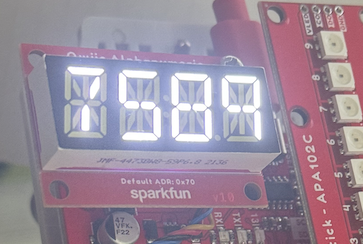

# A parking sensor

This is my first foray into this kind of computing. I've had a couple of Arduinos for years and have never done anything with them other than blink. My best buddy is a teacher in the Pacific Northwest and built a split-flap display. He has to jump through some hoops, which could be eliminated. But to help him, I needed to gain some experience with this kind of programming. This is the result.

I occasionally have difficulty judging how far into the garage I am. Sure, I could command tape a marker to the garage wall or listen to the car's parking sensor telling me I'm getting close to the wall. But that's no fun. 

```markdown

<video width="960" height="540" src="https://github.com/user-attachments/assets/31ec9c11-b12f-45dc-9a29-4fb5ece76d19"></video>
```

## The Device


Here's a list of the parts I used:

| Name                                      | Link                                    | Notes                                                      |
| ----------------------------------------- | --------------------------------------- | ---------------------------------------------------------- |
| SparkFun Thing Plus - Artemis             | https://www.sparkfun.com/products/15574 |                                                            |
| SparkFun Qwiic Mini dToF Imager - TMF8820 | https://www.sparkfun.com/products/19218 |                                                            |
| SparkFun Qwiic LED Stick - APA102C        | https://www.sparkfun.com/products/18354 |                                                            |
| Waterproof Outdoor Electrical Box         | https://www.amazon.com/dp/B0D2H8ZPG7    | The mounting board inside makes it easy to add stand-offs. |
| SparkFun Qwiic Alphanumeric Display - Red | https://www.sparkfun.com/products/16916 | Debug display, not required.                               |
| 16-foot USB-A to USB-C right-angle cable. | https://www.amazon.com/dp/B09ZTWHFHF    | The right-angle feature isn't required.                    |

#### Notes:



The alphanumeric display is helpful for testing but not required for "production."

I attempted to use a POE cable set, but it never seemed to provide enough power to operate the whole device.

